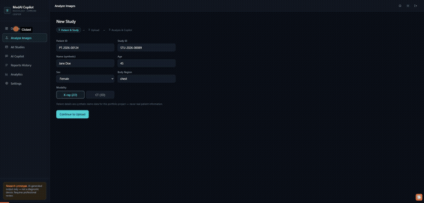

# Medical Imaging AI Copilot


An end-to-end **AI Copilot for medical imaging**: two real, trained
computer-vision models (2D chest X-ray classification, 3D lung CT nodule
screening) paired with a provider-agnostic **LLM layer** that explains
the vision models' own grounded findings in plain language — plus a full
React frontend (dashboard, analytics, report history, PDF generation)
around all of it.

> **This is not a diagnostic device.** All output is AI-generated and
> requires review by a qualified healthcare professional. Every patient
> and study identifier used anywhere in this app is synthetic demo data —
> never real patient information. See
> [`docs/MODEL_CARD.md`](./docs/MODEL_CARD.md) for real, measured model
> metrics and known limitations (nothing here is fabricated).



*Real walkthrough, not staged data: a chest X-ray uploaded and classified live
(PNEUMONIA, 99.98% confidence), Grad-CAM overlay, a grounded Copilot answer
and preliminary report from Groq (`openai/gpt-oss-120b`, with local Ollama
configured as fallback), and an existing multi-candidate 3D CT report (6
nodule locations). Two full sample reports (2D and 3D) are in
[`docs/sample_reports/`](./docs/sample_reports/).*

## Table of contents

- [Project aim](#project-aim)
- [The golden rule](#the-golden-rule)
- [Features](#features)
- [Architecture](#architecture)
- [Tech stack](#tech-stack)
- [Results — what this project actually achieved](#results--what-this-project-actually-achieved)
- [Project structure](#project-structure)
- [Getting started](#getting-started)
- [Training the models](#training-the-models)
- [Tests](#tests)
- [API overview](#api-overview)
- [Known limitations](#known-limitations)
- [License](#license)

## Project aim

Most "AI + medical imaging" demos do one of two things badly: either the
vision model quietly becomes the whole product (a black-box probability
with no explanation), or an LLM is pointed at a raw image and allowed to
free-associate a diagnosis it was never trained or validated to make.
This project's actual goal was to build the **correct architecture**
instead — vision models that produce structured, grounded findings, and
an LLM layer that is only ever allowed to explain those findings, never
invent new ones — and to prove every claim about it with a real,
measured number rather than an assumed one.

Concretely, that meant building and actually running: two trained
PyTorch vision models on real public medical datasets, a Grad-CAM
explainability layer, a provider-agnostic LLM gateway (Groq / Ollama /
Claude) with its own groundedness and safety validation pipeline, a
FastAPI backend, and a full React frontend around the whole workflow —
upload, analyze, explain, generate a PDF report, review history.

## The golden rule

```
Vision Model = analyzes the image, produces structured findings
LLM          = explains those grounded findings in plain language

NOT: LLM = medical diagnosis
```

The LLM never sees the raw image — only structured findings — and every
LLM response is validated for **groundedness** (it can't claim a finding
the vision model didn't produce) and **safety** (no confirmed-diagnosis
language, no ungrounded treatment claims) before it can reach a user.
See `src/safety/`.

## Features

- **2D chest X-ray classification** — ResNet50 transfer learning
  (NORMAL vs. PNEUMONIA), with Grad-CAM heatmap explainability and a
  drag-to-compare slider over the original/overlay.
- **3D lung CT nodule screening** — a from-scratch 3D CNN classifying
  LUNA16 candidate patches, with a click-to-pick coordinate UI (click a
  point on the displayed CT slice, converts to the world-mm coordinate
  the model needs) and a marked-location preview image.
- **Medical Copilot** — a provider-agnostic LLM layer (Groq / Ollama /
  Claude, switchable via config) that explains the vision model's
  findings, answers grounded follow-up questions, and falls back to a
  second provider if the primary one fails.
- **Safety pipeline** — groundedness validation + output-safety checks
  on every LLM response, input validation + prompt-injection heuristics
  on every question, deterministic keyword-lookup knowledge base (not a
  RAG chatbot).
- **Professional PDF reports** — patient/study metadata, findings,
  embedded Grad-CAM/location-preview image, AI impression, limitations,
  model/provider metadata; supports multiple candidate locations in one
  report (e.g. several CT nodules on one scan).
- **Full report history** — Dashboard (real aggregate stats), All
  Studies (searchable table), Analytics (real charts: modality mix,
  finding distribution, studies over time, LLM provider usage, safety
  pipeline stats), a standalone grounded AI Copilot chat over any past
  study, and report deletion.
- **Real light/dark theme**, no mocked data anywhere in the UI.

## Architecture

```
┌────────────────────────────────────────────────────────────────────────┐
│ React frontend  (Vite + TypeScript + Tailwind)                         │
│ Dashboard · New Study (X-ray/CT upload) · Reports History · All        │
│ Studies · Analytics · AI Copilot Chat · Settings                       │
└────────────────────────────────────────────────────────────────────────┘
                          │   REST — /api/v1/*  (src/main.py)
                          ▼
┌────────────────────────────────────────────────────────────────────────┐
│ Services  (src/services/)                                              │
│ imaging_service · copilot_service · report_service                     │
│ — orchestration only; callers never touch model/LLM internals directly │
└────────────────────────────────────────────────────────────────────────┘
                          │
                          ▼
┌────────────────────────────────────────────────────────────────────────┐
│ Vision   (src/vision/)                                                 │
│   ResNet50 (2D X-ray) · 3D CNN (CT candidate patches)                  │
│   Grad-CAM explainability (2D) · CT slice preview / coordinate mapping │
│                                                                        │
│ LLM Copilot + Safety   (src/llm/ + src/safety/)                        │
│   gateway.py routes to groq · ollama · claude · mock                   │
│   grounded ONLY on the vision model's structured findings —            │
│   never sees the raw image. groundedness.py + output_guard.py          │
│   validate every response before it reaches a user; falls back         │
│   to a 2nd provider on failure                                         │
│                                                                        │
│ Storage   (storage/)                                                   │
│   SQLAlchemy models + repositories (SQLite). report_service            │
│   renders and persists PDF reports (ReportLab)                         │
└────────────────────────────────────────────────────────────────────────┘
```

**Request flow, end to end:** an image (or CT candidate coordinate) is
uploaded → the vision model classifies it and Grad-CAM/CT-preview
renders an explanation image → those structured findings (never the raw
image) are handed to the LLM gateway → the safety pipeline validates the
response for groundedness and safety before it reaches the frontend →
the user can save the result and generate a PDF report, which is
persisted to SQLite and downloadable from Reports History.

## Tech stack

| Layer | Choice |
|---|---|
| Backend | FastAPI, Pydantic, SQLAlchemy (SQLite) |
| Vision | PyTorch, ResNet50 (2D), custom 3D CNN, SimpleITK/pydicom (CT I/O) |
| Explainability | Grad-CAM |
| LLM | Groq, Ollama (local), Anthropic Claude — one gateway interface |
| PDF | ReportLab |
| Frontend | React 19, TypeScript, Vite, Tailwind CSS, React Router |
| Testing | pytest (backend), `tsc`/`oxlint` (frontend) |
| Infra | Docker, Docker Compose, GitHub Actions |

## Results — what this project actually achieved

Every number below is measured from a real run, not estimated or
assumed — full detail (confusion matrices, exact splits, hardware) in
[`docs/MODEL_CARD.md`](./docs/MODEL_CARD.md).

**2D chest X-ray classifier (ResNet50):** ROC-AUC **0.9919**, sensitivity
**0.9883**, measured on a 915-image, patient-disjoint held-out test set
(the official Kaggle split is *not* patient-disjoint — this project
re-splits by patient ID from scratch to get a trustworthy number).

**Copilot safety pipeline:** 8/8 required failure-case scenarios pass —
including a prompt-injection case where the safety layer correctly
rejects unsafe output even when the LLM itself complies with the
injection (`evaluation/copilot_eval.py`).

**Full-stack delivery:** real FastAPI + React app with 11 endpoints,
report history/dashboard/analytics, PDF generation, Docker + CI —
not just a training notebook. See the demo GIF above, or the two real
generated sample reports directly:
[2D X-ray report](./docs/sample_reports/sample_report_2d_xray.pdf) ·
[3D CT report](./docs/sample_reports/sample_report_3d_ct.pdf).

### 3D lung CT nodule model — an honest result, by design

The 3D CNN (trained from scratch on LUNA16 `subset0`, 89 of the
dataset's ~880 total scans) reaches ROC-AUC **0.7771** and sensitivity
**0.6667**, but precision at the default 0.5 threshold is very low
(**0.3%**, ~154 false positives per scan) — a direct consequence of the
test split's extreme class imbalance (only 9 real nodules in 9,190
candidates).

Three real ways to improve this were deliberately considered and **not
pursued**: threshold tuning off the PR curve, swapping in a pretrained
3D backbone (e.g. `torchvision`'s `r3d_18`), and training on more LUNA16
subsets with a false-positive-reduction cascade (the standard approach
real LUNA16 solutions use). All three are legitimate next steps, but
none of them changes the underlying constraint — a single-subset,
9-positive test set — and chasing a better-looking number off it would
have produced a *less* trustworthy result, not a more capable model.
**The model ships as-is, with this limitation documented rather than
tuned away.** For a portfolio piece, an honestly-measured 0.3% is a more
defensible artifact than a polished number that can't be traced back to
real data.

## Project structure

```
src/                          FastAPI app
├── main.py                    app entrypoint, all /api/v1 routes
├── config.py                  Pydantic Settings (env-driven config)
├── preprocessing/
│   ├── preprocess_2d.py        X-ray load/resize/normalize
│   └── preprocess_3d.py        CT volume load/resample/normalize
├── vision/
│   ├── model_2d.py             ResNet50 (2D) definition
│   ├── model_3d.py             3D CNN definition
│   ├── inference.py            unified analyze_xray / analyze_ct
│   ├── gradcam.py               2D Grad-CAM
│   ├── ct_preview.py           CT slice render + coordinate mapping
│   └── dataset_2d.py / dataset_3d.py   training-time datasets
├── llm/
│   ├── gateway.py               provider-agnostic factory + fallback
│   ├── groq_provider.py / ollama_provider.py / claude_provider.py / mock_provider.py
│   ├── prompts.py               structured-output prompt templates
│   └── knowledge_base.py       deterministic keyword-lookup KB retrieval
├── safety/
│   ├── groundedness.py          rejects ungrounded LLM claims
│   ├── output_guard.py          rejects unsafe LLM output
│   └── input_guard.py           input validation + prompt-injection heuristics
├── services/
│   ├── imaging_service.py       orchestrates vision + Grad-CAM/preview
│   ├── copilot_service.py       orchestrates LLM + safety pipeline
│   └── report_service.py        orchestrates PDF generation + persistence
└── schemas/                    Pydantic request/response models (api, imaging, llm)

storage/                       SQLAlchemy models + repositories (report history DB)
training/                      train_2d.py, train_3d.py — real training scripts
configs/                       train_2d.yaml, train_3d.yaml — training configuration
evaluation/                    real evaluation scripts + results (2D/3D metrics, safety eval)
knowledge_base/                deterministic medical reference content for the LLM
docs/MODEL_CARD.md             real, measured model metrics & limitations

frontend/src/                 React + TypeScript + Vite app
├── pages/                     Dashboard, NewStudy, AllStudies, Analytics,
│                               ReportsHistory, ReportView, CopilotChat, Settings
├── components/                AnalysisResult, CompareSlider, CopilotPanel,
│                               CtUploadAndPicker, XrayUpload, PatientForm, …
├── api/                       client.ts (fetch wrapper), types.ts
└── lib/                       theme.ts (light/dark)

tests/                         pytest suite — mocked/CI-safe unit + API tests,
                                plus real-data integration tests that self-skip
                                when checkpoints/data aren't present
```

---

## Getting started

### Prerequisites

- Python 3.14 (3.11+ likely works; only 3.14 has been used in practice — see `Dockerfile`)
- Node.js 22+
- An LLM provider: [Ollama](https://ollama.com) running locally (no API key needed — this is what most of the project was actually tested against), **or** a Groq API key, **or** an Anthropic API key
- (Optional, for training/full data) the two datasets below

### 1. Get the checkpoints and (optionally) the data

Trained checkpoints are gitignored (large binaries — not committed to
this repo's git history) but downloadable from
**[Release v1.0.0](https://github.com/sivasoundhar/medical-imaging-ai-copilot/releases/tag/v1.0.0)**:
grab `model_2d_best.pth` and `model_3d_best.pth` and place them at
`training/checkpoints/model_2d_best.pth` and
`training/checkpoints/model_3d_best.pth`. The backend starts fine
without them too — `/imaging/analyze` correctly returns a **503**, never
a fabricated prediction, if the checkpoint file for the requested
modality is missing (see `src/vision/inference.py`).

To retrain from scratch instead (see
[Training the models](#training-the-models) below), or to run
`tests/test_api_integration.py` (the real-data integration tests, which
self-skip if the data isn't present), you'll also need the datasets:

**2D — Kaggle "Chest X-Ray Images (Pneumonia)"**
https://www.kaggle.com/datasets/paultimothymooney/chest-xray-pneumonia
Extract so you have:
```
Data/chest_xray/train/{NORMAL,PNEUMONIA}/*.jpeg
Data/chest_xray/val/{NORMAL,PNEUMONIA}/*.jpeg
Data/chest_xray/test/{NORMAL,PNEUMONIA}/*.jpeg
```
(The official train/test split is **not** patient-disjoint — this
project re-splits by patient ID from scratch; see `training/train_2d.py`.)

**3D — LUNA16** (lung nodule CT scans)
https://luna16.grand-challenge.org/Data/
This project only uses `subset0` (89 scans). Download `subset0.zip`,
`annotations.csv`, and `candidates.csv`, and extract so you have:
```
Data/subset0/*.mhd
Data/subset0/*.raw
Data/annotations.csv
Data/candidates.csv
```

`Data/` is gitignored entirely — never committed, always sourced locally.

### 2. Backend

```bash
python -m venv .venv
.venv\Scripts\activate        # Windows — `source .venv/bin/activate` on macOS/Linux
pip install -r requirements.txt
cp .env.example .env          # fill in an LLM provider — see table below
uvicorn src.main:app --reload
```

Check `GET http://localhost:8000/health`, then
`http://localhost:8000/docs` for the interactive OpenAPI reference.

### 3. Frontend

```bash
cd frontend
npm install
npm run dev
```

Open `http://localhost:5173` — the Vite dev server proxies `/api/*` to
the backend on `:8000` (see `frontend/vite.config.ts`).

### 4. Environment variables (`.env`)

| Variable | Required | Notes |
|---|---|---|
| `LLM_PROVIDER` | yes | `groq` \| `ollama` \| `claude` \| `mock` |
| `LLM_FALLBACK_PROVIDER` | no | second provider to try if the primary fails after retries |
| `GROQ_API_KEY` / `GROQ_MODEL` | if using Groq | e.g. `openai/gpt-oss-120b` — check Groq's current model list, models get deprecated |
| `OLLAMA_BASE_URL` / `OLLAMA_MODEL` | if using Ollama | default `http://localhost:11434`, model `llama3.2` (`ollama pull llama3.2` first) |
| `ANTHROPIC_API_KEY` / `CLAUDE_MODEL` | if using Claude | defaults to `claude-opus-5` if model left blank |
| `DATABASE_URL` | no | blank uses `storage/app.db` |

Full reference: `.env.example`.

### 5. Docker (both services)

```bash
docker compose up --build
```

Backend on `:8000`, frontend on `:3000`. Trained checkpoints are baked
into the backend image **if present locally at build time**
(`training/checkpoints/*.pth` — gitignored). If `LLM_PROVIDER=ollama`
and Ollama runs on your host (not in this compose file), see
`docker-compose.yml`'s comment on `host.docker.internal`.

---

## Training the models

Configs: `configs/train_2d.yaml`, `configs/train_3d.yaml` (dataset
paths, split fractions, hyperparameters — engineering defaults, not
medical-validation requirements).

```bash
python -m training.train_2d --config configs/train_2d.yaml
python -m training.train_3d --config configs/train_3d.yaml
```

Both were actually run for real (2D on Colab, 3D on local GPU hardware)
— see `docs/MODEL_CARD.md` for the exact training runs (epochs, data,
hardware) and the resulting metrics.

## Tests

```bash
pytest                                     # full suite — mocked/synthetic, no
                                            # real network calls, no GPU required
pytest tests/test_api_integration.py -v    # real checkpoints + real data,
                                            # self-skips if either is absent
```

```bash
cd frontend && npm run lint && npm run build   # lint + type-check + build
```

## API overview

All endpoints under `/api/v1` (full interactive docs at `/docs`):

| Method | Path | What it does |
|---|---|---|
| GET | `/health` | liveness check |
| GET | `/system/info` | read-only config: active LLM provider/model, checkpoint status |
| POST | `/imaging/analyze` | run 2D X-ray or 3D CT candidate inference |
| POST | `/imaging/ct-preview` | render a CT slice + coordinate metadata for the click-to-pick UI |
| POST | `/copilot/report` | grounded preliminary report from vision findings |
| POST | `/copilot/ask` | grounded Q&A about an analysis |
| POST | `/report/generate` | render + persist a PDF report (one or more candidates) |
| GET | `/reports` | list report history |
| GET | `/reports/{id}` | full report detail |
| GET | `/reports/{id}/pdf` | download the PDF |
| DELETE | `/reports/{id}` | permanently delete a report + its PDF |

## Known limitations

- Not clinically validated — a portfolio/research prototype only.
- 3D model precision is very low at the default threshold — a real,
  measured, and deliberately-not-tuned-away result; see
  [Results](#results--what-this-project-actually-achieved) above and
  `docs/MODEL_CARD.md` for the full detail.
- No lung-field cropping in the 2D preprocessing pipeline — Grad-CAM has
  been observed keying on non-anatomical cues (burned-in markers,
  shoulder soft tissue) in at least one case; see `docs/MODEL_CARD.md`.
- No authentication/authorization — out of scope for this portfolio
  project (all patient/study data is synthetic demo data).
- Not yet deployed to a public URL — currently runs locally, or via
  Docker (`docker compose up --build`) for anyone who wants a
  containerized setup.

## License

MIT — see [`LICENSE`](./LICENSE). The trained model checkpoints, the
`Data/` datasets, and any real report/patient data generated while
running the app are **not** covered by this license (checkpoints and
`Data/` are gitignored and never distributed with this repo; report
data is synthetic demo content, gitignored, and never committed either).
